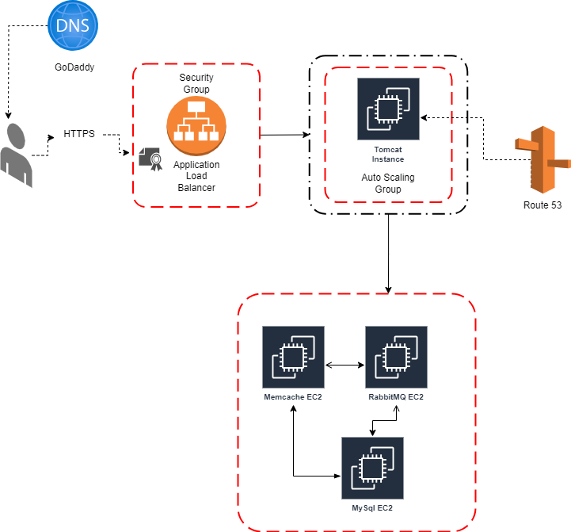

This Project is a java web application deployed on aws cloud using below tech stack

AWS cloud ec2 instance for:
1. Tomcat server which is hosting our Application
2. Memcache server which will be used to store the frequently acessd user from database 
3. MariaDB server for storing the use data
4. rabbitMQ server

AWS Route 53 to route the traffic to our data base servers that will recevie traffic from the Elastic Load balancer.

Go Daddy as a Domain Provider 

Amazon certificate Manager for the certifcate used in https.

